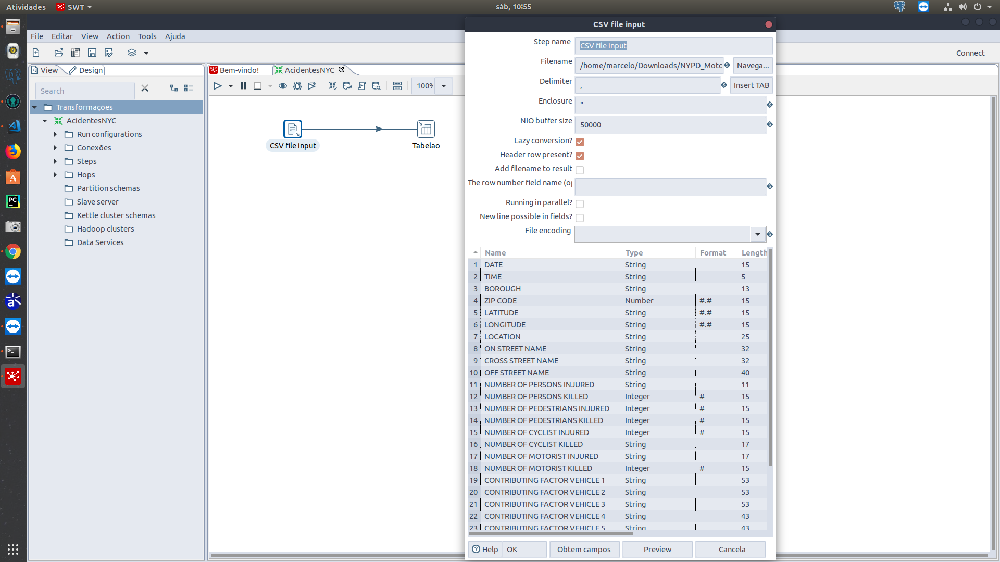
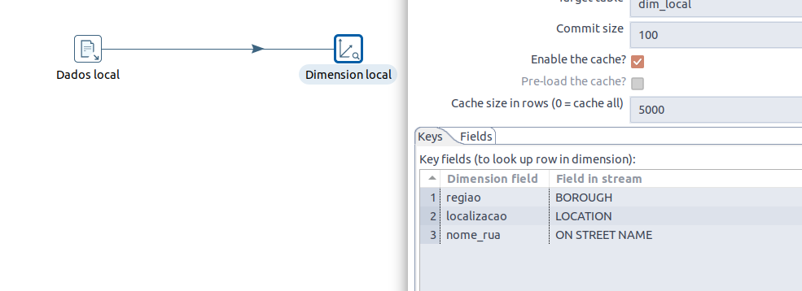
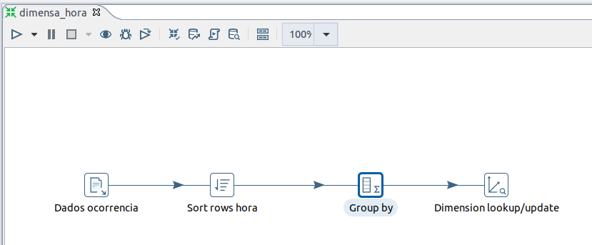
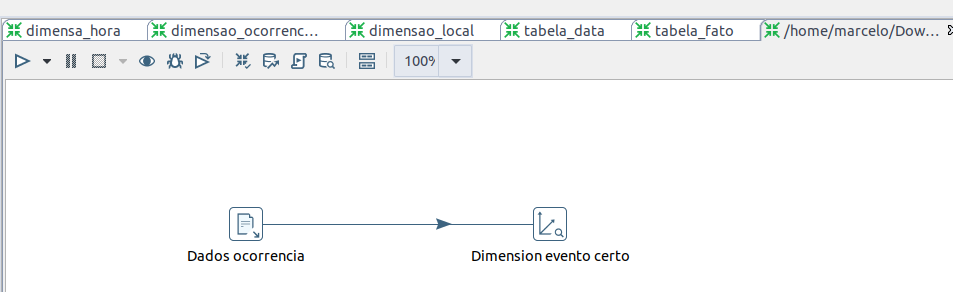
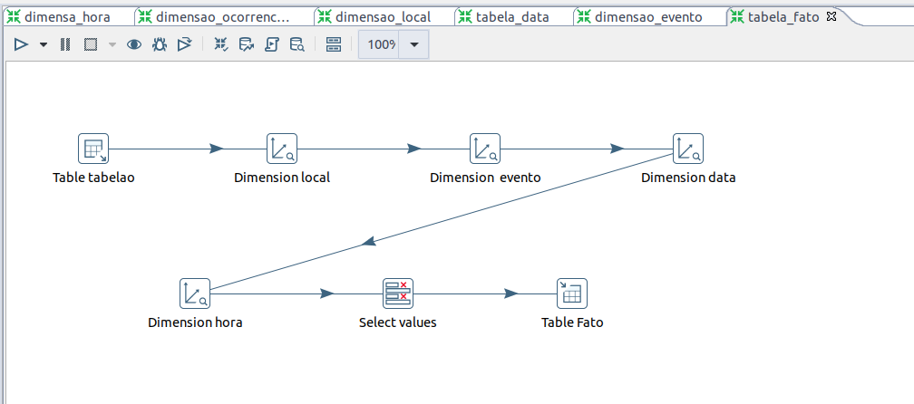

# Big Data

## Membros
1. Marcelo Passamai Mendes
2. Tadeu da Penha Júnior

## Descricao da base de dados
A base de dados selecionada retrata a ocorrência de acidenetes na cidade de nova iorque, alguns dos seus dados são localidade, motivos, data e hora, envolvidos e etc.  
[link para download da base de dados](https://data.cityofnewyork.us/Public-Safety/NYPD-Motor-Vehicle-Collisions/h9gi-nx95?fbclid=IwAR2XYyTJ3G03QmmkpV5kyPQ2r9dAR8_fhWquPDzGMc0HL2vRZEX192oduEI)
 
# Modelagem do DW
## Fast Immersion Canvas

## Fast modelling Canvas 

## Fast ELT Acidentes NYC
[pdf]()
  
## PDI gerando dimensões

### carga dos dados

  

### dimensão local

  

### dimensão hora

  

### dimensão evento

  

### criação da tabela fato

  

## Mapa de acidentes
[link para o mapa](https://nbviewer.jupyter.org/github/MarceloMendes94/big-data/blob/master/mapa_nyc.ipynb) 
